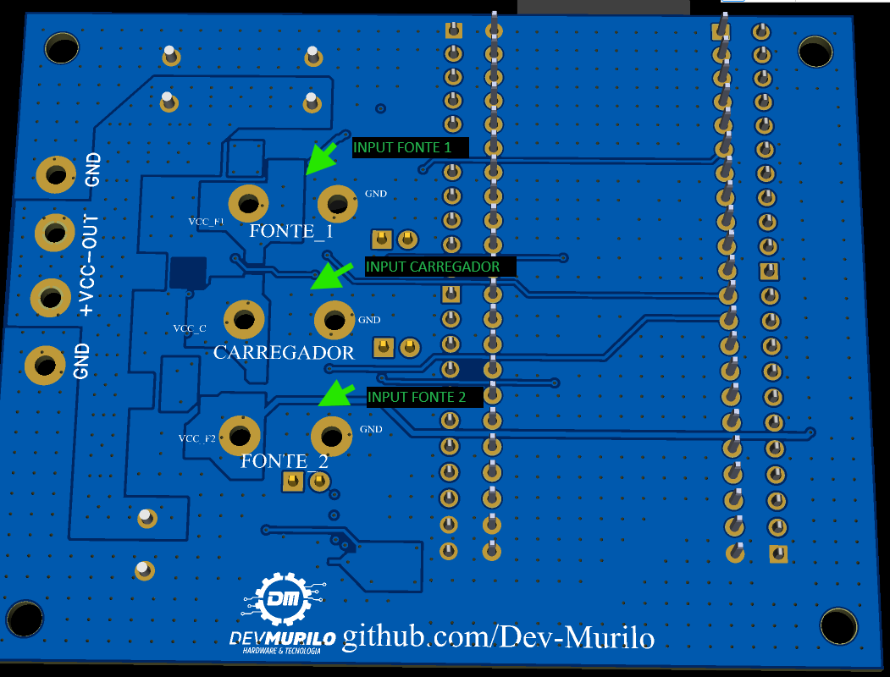
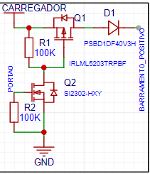
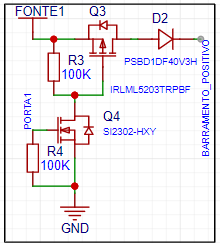
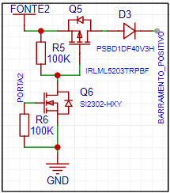
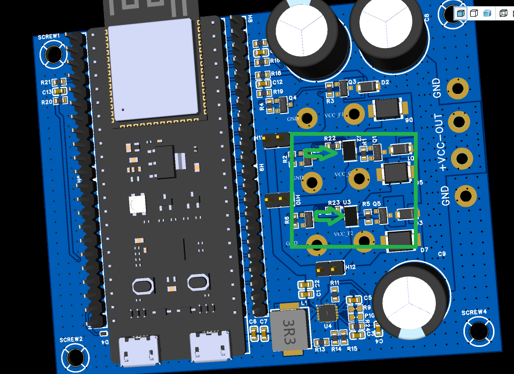
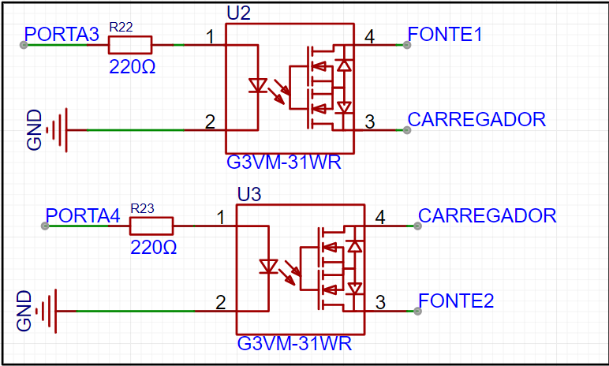
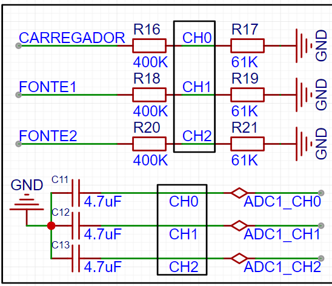
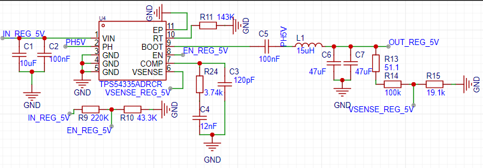
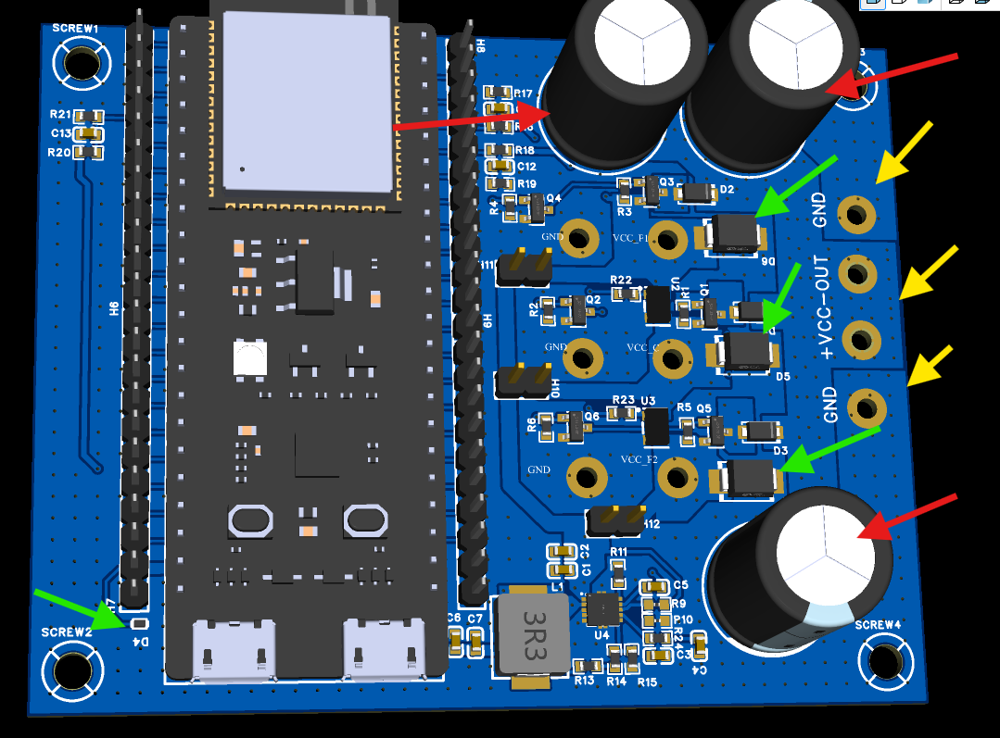
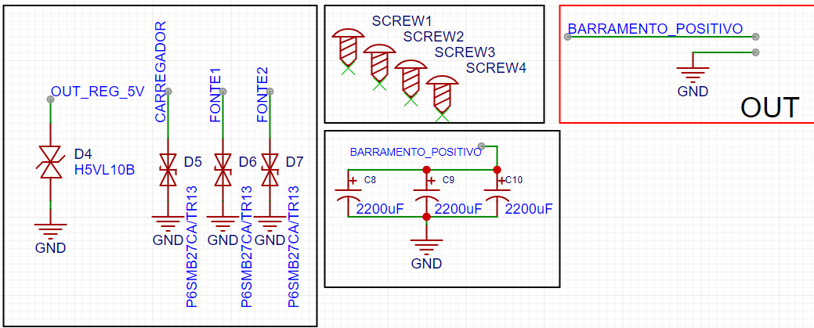

### This project aims to deliver power to the load so that it can have greater autonomy and decision-making capacity to supply loads that require monitoring and redundant operation with the possibility of hot-swapping the battery.

## Power output control circuits.

Here is the points that you can solder the cables. 
By default in the code, was made to use adc precision of 10 bits, because of the usage of another uC, the middle positions are configured to act as dc charger. 
#### Batery used to develop was Vmount 14,8V with the constant load not exceeding 3Amp

INPUT CARREGADOR:

INPUT FONTE1 

INPUT FONTE2

## Circuit for source parallelism, Example of battery recharging use case.
You can use this relays to short circuit terminals form middle input and outer inputs, and you can monitoring dc charging and configure how it will work. Maximum of 3Amps

## Circuit for ADC input and Voltage divider
Voltage divider circuit and reading: -- 25V to 3.3V

## Circuito regulador stepdown 5V
Pins to set with suply will be used to act to maintain the uC. 

## ESD protections, Capacitor bank, Power buffer, Output bus
In red is the power buffer, to handle the time without suply in case of hotswap. 

In yelow is the output as gnd vcc vcc gnd.

In green is the esd components

