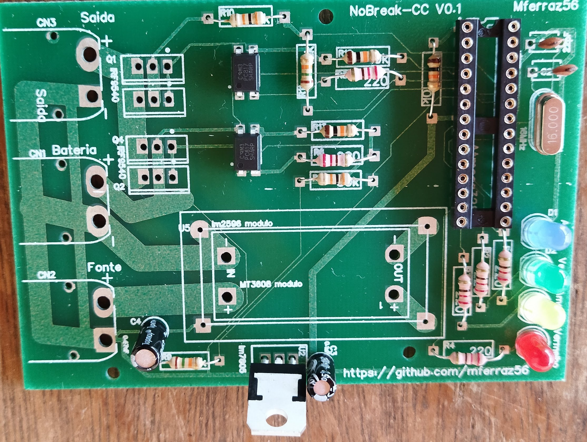
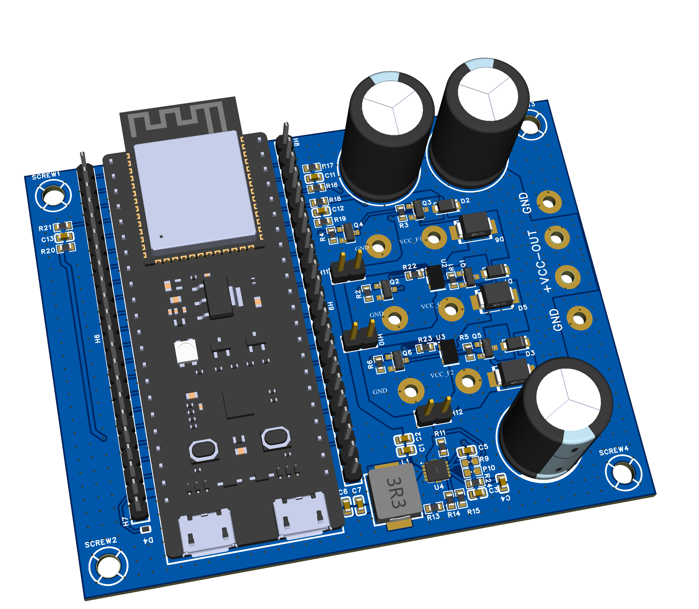
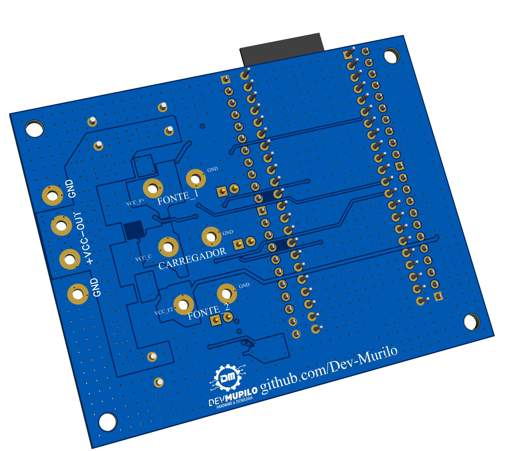

# esp32-ups-nobreak

## FIRST VIEW
Click here to go to the first viwe of main features, pins of 
[esp32-ups-nobreak](https://github.com/Dev-Murilo/esp32-ups-nobreak/tree/main/Doc)

##


O **esp32-ups-nobreak** é um projeto de nobreak (UPS - Uninterruptible Power Supply) que oferece suporte a diferentes aplicações devido à possibilidade de customização tanto por software quanto por hardware.

## Tabela de Conteúdo

- [Histórico do Projeto](#histórico-do-projeto)
  - [Primeira Versão](#primeira-versão)
  - [Segunda Versão](#segunda-versão)
  - [Terceira Versão (Atual)](#terceira-versão-atual)
- [Funcionalidades](#funcionalidades)
- [Configuração do Software Atual](#configuração-do-software-atual)
  - [Telemetria](#telemetria)
  - [Exemplo de Telemetria](#exemplo-de-telemetria)
- [Considerações sobre as Fontes de Alimentação](#considerações-sobre-as-fontes-de-alimentação)
- [Licença](#licença)

## Histórico do Projeto

### Primeira Versão
- Desenvolvido usando o uChip do Arduino Uno.
- Objetivo: Utilização com impressoras 3D.
- Status: Não entrou em produção.



### Segunda Versão
- Critérios:
  - Utilização da menor área possível.
  - Teste e validação em tempo recorde.
  - Controle completo sobre baterias (qual alimenta a carga, qual é carregada, ordem de prioridade de carga e descarga).
  - Implementação de baterias V-mount.
- Status: Foi desenvolvido com sucesso.

### Terceira Versão (Atual)
- Utilização da placa de desenvolvimento **ESP32-S3 DevKit (44 pinos)**.
- Objetivo: Maior flexibilidade para controlar mais itens.
- Motivo da escolha da placa de desenvolvimento: Custo mais baixo em comparação ao embarque direto do ESP32 na PCB.



## Funcionalidades

- **Entradas de Energia DC**: 3
- **Saída de Energia DC**: 1
- **Leitura ADC das entradas de energia**
- **Tomada de decisão com base nas leituras**
- **Sinais de Controle**: 5
  - 3 para controle de MOSFET (como chave para direcionar as entradas para a saída).
  - 2 para controle de relé SMD (para paralelizar fontes, como no caso de recarregar a bateria).

## Configuração do Software Atual

- O sistema realiza verificações e leituras das fontes disponíveis ao ligar.
- **Bateria Interna (Fonte 1)**: 
  - Usada como principal.
  - Prioridade em se manter carregada na presença de um carregador.
- **Bateria Externa**:
  - Prioridade na descarga.
  - Carregada apenas quando a bateria interna estiver totalmente carregada.
  - Quando ambas estiverem carregadas, os dois relés são acionados para manter as duas baterias carregadas durante o uso.
  
### Telemetria
- Exportada via serial ou USB em formato numérico: `(0,6,86,0,74)`
  - **0 ou 1**: Indica se a bateria externa está presente e sendo usada para alimentar o equipamento (1) ou se está ausente ou descarregada (0).
  - **0-1023**: Leitura ADC de 10 bits da tensão da bateria externa.
  - **0-1023**: Leitura ADC de 10 bits da tensão da bateria interna.
  - **0 ou 1**: Presença do carregador.
  - **0-1023**: Leitura ADC de 10 bits da tensão do carregador.

### Exemplo de Telemetria
[VEJA O VIDEO](https://youtu.be/NBOAWUM_bD8)

```plaintext
(0,6,86,0,74)
```

- **String Format**: `String(bateria_externa_conectada) + "," + String(Tensao_bateria_externa) + "," + String(Tensao_bateria) + "," + String(carregador_conectado) + "," + String(Tensao_carregador);`

## Considerações sobre as Fontes de Alimentação

- **Baterias V-mount**: Tensão nominal de 14.8V, 16.6V - 16.8V em carga máxima.
- **Fontes Maiores**: Podem causar danos nos circuitos destinados à potência.
- **Fontes Menores**: Requerem alterações no código para redefinição dos parâmetros.

## Licença
-Non-comercial usage without authorization.